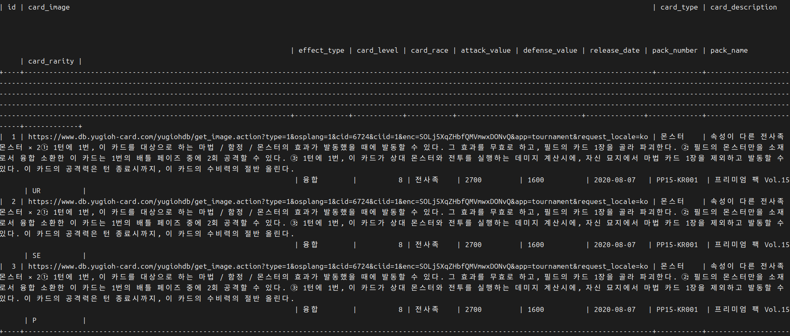

# ❌ [에러 메시지 or 문제 상황]

## ⚠️ 발생한 문제
- mysql의 데이터를 python에서 출력할 때 columns이 제대로 출력되지 않음


## 🔍 원인 분석
- mysql에서 직접 출력해봄.

<p align="center" style="color:gray">
  
mysql에서는 정상적으로 출력됨
</p> 

- 비슷한 코드에서 실행했을 때는 정상적으로 작동함.
- python에서 작성한 insert 구분을 그대로 mysql에 넣었을 때 정상적으로 삽입됨.
- 삽입되는 데이터는 모두 정상.
- insert할 때 column의 개수와 values의 개수 모두 맞음.
- 오직 python에서 출력할 때만 column에 문제가 생김.

## ✅ 해결 방법
- mysql과 python과 연결하는 ```pymysql.connect```에 ```cursorclass=pymysql.cursors.DictCursor```를 추가해주면 된다.  
  ex) ```pymysql.connect(host='127.0.0.1', user='apic', password='1234', db='YUGIOH', charset='utf8', cursorclass=pymysql.cursors.DictCursor)```
- 가져오는 데이터를 바로 dict으로 바꿔줘 해결되는 듯 하다.

## 🔗 참고 자료
- chatgpt
- https://otzslayer.github.io/python/2022/09/29/using-dictcursor-in-pymysql.html