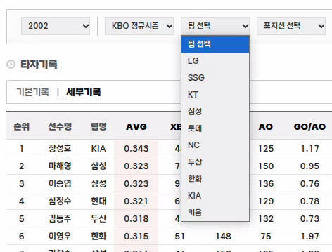

# 📌 playwright에서 드롭다운 선택하기 (비동기)

# ❌ [에러 메시지 or 문제 상황]

## ⚠️ 발생한 문제

<p align="center" style="color:gray">
  <!-- 마진은 위아래만 조절하는 것이 정신건강에 좋을 듯 하다. 이미지가 커지면 깨지는 경우가 있는 듯 하다.-->
  
  2002년도인데 키움과 ssg, nc가 있다.
</p> 

- 연도를 변경했음에도 팀 드롭박스가 변경되지 않았다.  
  다른 기록은 2001년에서 2002년으로 넘어가면 해결되었지만 세부기록은 그 방법으로 할 수 없었다.  

## 🔍 원인 분석
- 화면을 새로고침 해본다. -> 2025년으로 바뀐다.
- 특정 태그(드롭다운)만 새로고침 해본다. -> 새로고침되지 않았다.
```pyhon
dropdown_element = WebDriverWait(driver, 10).until(EC.presence_of_element_located((By.CSS_SELECTOR, tag)))
driver.execute_script("arguments[0].dispatchEvent(new Event('change'))", dropdown_element)
```

## ✅ 해결 방법
- 자바스크립트를 이용해 페이지 초기화
```python
element = driver.find_element(By.CSS_SELECTOR, '#cphContents_cphContents_cphContents_ucPager_btnNo2')
driver.execute_script("arguments[0].click();", element)
```

## 🔗 참고 자료
- https://bba-jin.tistory.com/30
